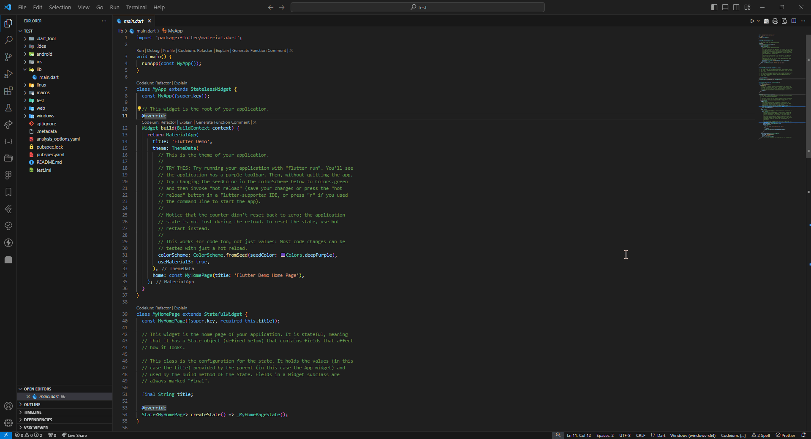
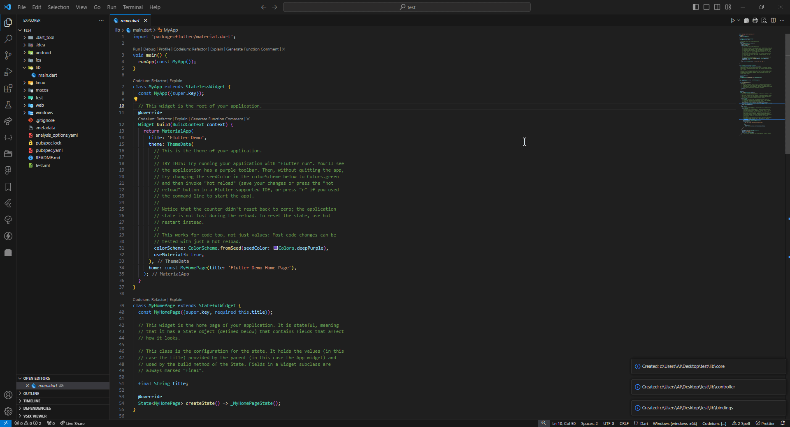
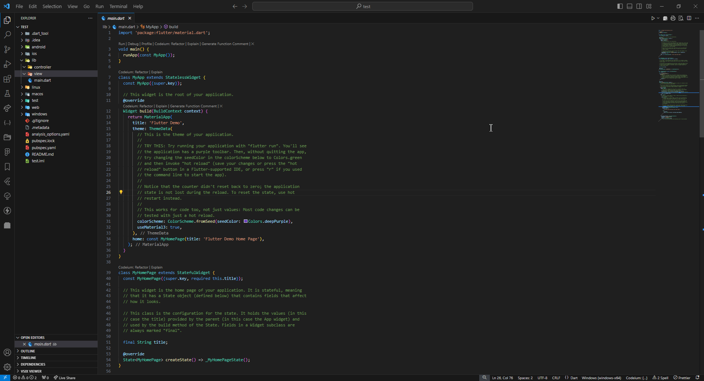

<p align="left"> <a href="https://x.com/AmeerImad99" target="blank"></a> </p>


# Flutter Lib Manage 


**Flutter Lib Manage** is a Visual Studio Code extension designed to simplify the creation of new Flutter projects. It automatically generates a project structure with the necessary files and folders within the `lib` directory, following a unified MVC pattern. This saves you time and effort by providing a well-organized structure for your Flutter projects.

## How to use

#### Full structure


#### Create a specific structure


#### Create dart file


## Features

- Automatically creates a Flutter project structure with essential files and folders.
- Supports creating new files within the project structure.
- Provides a custom Tree View within VSCode to organize and manage extension options.

## Approved Structure

The extension generates a standardized project structure for Flutter projects, following the MVC pattern. The approved structure includes:

- **bindings/**: Includes setup and initialization files
- **controller/**: Contains controllers for your application
- **core/**
  - **class/**: Contains class definitions
  - **constant/**: Contains constant values
  - **functions/**: Contains utility functions
  - **localization/**: Contains localization files
  - **middleware/**: Contains middleware logic
  - **services/**: Contains services used in the application
  - **shared/**: Contains shared resources and utilities
- **data/**
  - **datasource/remote/**: Contains remote data sources
  - **datasource/static/**: Contains static data sources
  - **model/**: Contains data models
- **view/**
  - **screen/**: Contains screen widgets
  - **widget/**: Contains reusable widgets

## More clearly

```bash
-- lib
    ├── bindings
    ├── controller
    ├── core
    │   ├── class
    │   ├── constant
    │   ├── functions
    │   ├── localization
    │   ├── middleware
    │   ├── services
    │   └── shared
    ├── data
    │   ├── datasource
    │   │   ├── remote
    │   │   └── static
    │   └── model
    ├── view
    │   ├── screen
    │   └── widget
    ├── main.dart
```


## Installation

1. **Install the extension from the VSCode Marketplace:**

   Search for "Flutter Lib Manage" in the [VSCode Marketplace](https://marketplace.visualstudio.com/) and install it directly.

2. **Install the extension locally:**

   If you are developing the extension locally, you can install it from the source:

   ```bash
   git clone https://github.com/AmeerImad/flutter-lib-manage.git
   cd flutter-lib-manage
   npm install
   npm run compile
   vsce package
   code --install-extension name.vsix
